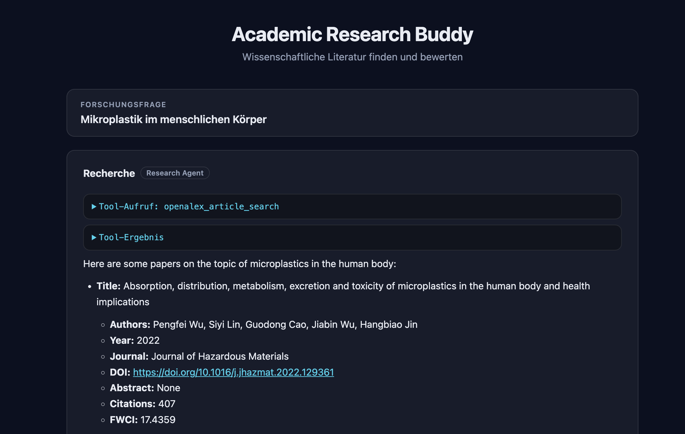

# Academic Research Buddy
### A Haystack Research Agent

A research agent built with [Haystack](https://haystack.deepset.ai/) and Google's [Gemini API](https://aistudio.google.com). The research agent searches OpenAlex for scientific literature, and a reviewer agent then evaluates the papers it finds.



The project can be used in two ways:

- **Web interface** (`app.py`): starts a local server and opens the browser. You click **Start**, enter your research question, and the output is shown live and formatted (tables, tool calls).
- **Terminal** (`main.py`): the simpler version with input directly in the terminal.

## Requirements

- Python 3.10+
- [uv](https://astral.sh/uv) (package manager)
- Gemini API key → free at [aistudio.google.com](https://aistudio.google.com)
- Groq API key → free at [console.groq.com](https://console.groq.com) (fallback model)

### Installing uv (on macOS)

```bash
curl -LsSf https://astral.sh/uv/install.sh | sh
```

## Installation

```bash
# Clone the repository
git clone https://github.com/MoritzSt4/haystack-research-agent.git
cd haystack-research-agent

# Install dependencies (automatically creates a .venv)
uv sync
```

## Configuration

Create a `.env` file in the same folder as `app.py` / `main.py` and add the following values:

```
GOOGLE_API_KEY=your_gemini_key_here
GROQ_API_KEY=your_groq_key_here
OPENALEX_API_KEY=your_openalex_key_here
```

- `GOOGLE_API_KEY` – free at [aistudio.google.com](https://aistudio.google.com) → **Get API key**.
- `GROQ_API_KEY` – free at [console.groq.com](https://console.groq.com) → **API Keys**. Used for the fallback model in case Gemini is unavailable.
- `OPENALEX_API_KEY` – free at  [openalex.org/settings/api](https://openalex.org/settings/api) → for the OpenAlex search.

**Important: never push the API key to the Git repo, and keep it only in the `.env` file. (Check that the `.env` file is listed in the `.gitignore` file, so it doesn't get pushed to the repo. Also only ever use the API key in the code via the `.env` variable, never enter it directly.)**

## Running the project

### Web interface (recommended)

```bash
uv run python app.py
```

The server starts at `http://127.0.0.1:8000` and opens the browser automatically. To stop it, quit the program in the terminal with `Ctrl + C`.

### Terminal version

```bash
uv run python main.py
```

## Project structure

```
haystack-research-agent/
├── app.py             # Web backend (FastAPI): serves the UI and streams the agent output
├── main.py            # Terminal entry point: same pipeline, output printed to the console
├── agents.py          # Definitions of the two agents (research + reviewer)
├── tools.py           # The tools the research agent can call (OpenAlex, Unpaywall)
├── static/
│   └── index.html     # Single-page web interface (start button, input, live output)
├── pyproject.toml     # Project metadata and dependencies
└── .env               # API keys (not committed)
```

## How it works

The core is a Haystack [`Pipeline`](https://docs.haystack.deepset.ai/docs/pipelines) made of two agents that run one after the other:

```
User question
      │
      ▼
┌──────────────────┐     tool calls      ┌─────────────────────────┐
│  Research Agent  │ ──────────────────▶ │  OpenAlex / Unpaywall   │
│   (searcher)     │ ◀────────────────── │        (tools.py)       │
└──────────────────┘   bibliographic     └─────────────────────────┘
      │  data
      │  messages (found papers)
      ▼
┌──────────────────┐
│  Reviewer Agent  │  ──▶  Markdown table scoring each paper (1–10)
│   (reviewer)     │
└──────────────────┘
```

1. **Research agent** (`create_research_agent` in `agents.py`) receives the user's question and searches for scientific literature using the tools in `tools.py`. It outputs the full bibliographic data (title, authors, year, journal, DOI, abstract, citations, FWCI).
2. **Reviewer agent** (`create_reviewer_agent` in `agents.py`) reads the papers the research agent found and evaluates each one for relevance and scientific quality, returning a Markdown table with a score from 1 to 10.

The two agents are connected in the pipeline via `searcher.messages → reviewer.messages`, so the reviewer sees both the original question and the papers.

### Language models

Both agents use a `FallbackChatGenerator`:

- **Primary:** Google Gemini (`gemini-2.5-flash-lite`)
- **Fallback:** Groq (`llama-3.3-70b-versatile`), used automatically if Gemini is unavailable.

### Tools (`tools.py`)

- **`openalex_article_search`** – searches [OpenAlex](https://openalex.org) for papers matching a query. Reconstructs the abstract from OpenAlex's inverted index and returns compact results (title, up to 5 authors, year, journal, DOI, citation count, FWCI, PDF link).
- **`unpaywall_doi_lookup`** – looks up the Open Access status and links for a given DOI via [Unpaywall](https://unpaywall.org).

### Terminal vs. web

The only difference between the two entry points is where the agent output goes:

- **`main.py`** uses Haystack's default `print_streaming_chunk` callback, which prints the streamed output to the terminal.
- **`app.py`** passes a custom streaming callback into the agents (`agents.py` accepts a `streaming_callback` parameter) that forwards each chunk to the browser via Server-Sent Events, where `static/index.html` renders it as formatted Markdown, tables and collapsible tool calls.

The agent and tool logic itself is identical for both — the web layer is built *around* the existing code, not into it.
